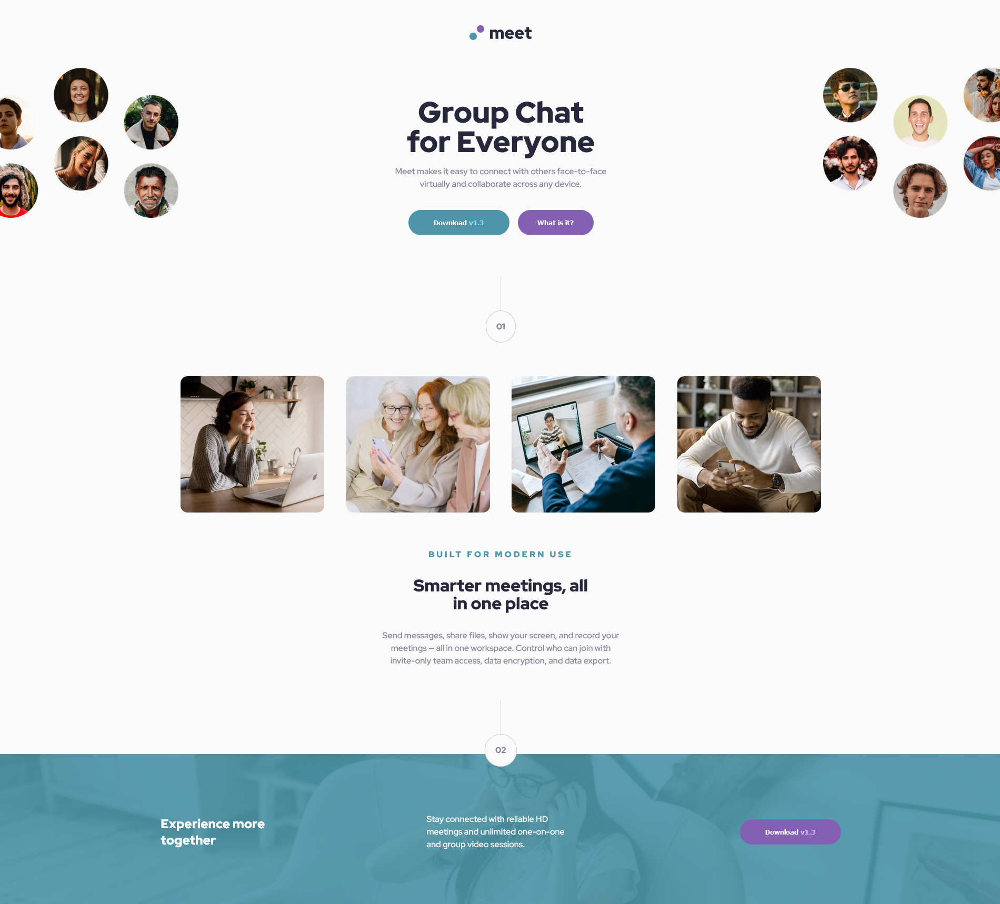

# Meet landing page


### The challenge

Users should be able to:

- View the optimal layout depending on their device's screen size
- See hover states for interactive elements

### Screenshot




### Links

- Solution URL: [Solution URL](https://www.frontendmentor.io/solutions/meet-landing-page-mrBDutxZWY)
- Live Site URL: [Live site](https://kaleidoscopic-rabanadas-1b02f1.netlify.app/)

## My process

### Built with

- Semantic HTML5 markup
- SCSS
- Flexbox
- CSS Grid
- Mobile-first workflow

### What I learned

This challenge was great practice for reinforcing my HTML and SCSS skills. I learned more about overflow in CSS more speficially overflow-x as I needed to clip parts of the hero images for the landing page. By using SCSS I was able to reduce the redundant SCSS I wrote with @extend from SASS. I also used this challenge to get better at using the BEM CSS methodology to write cleaner SCSS.

```css
body {
  overflow-x: hidden;
}
```

```scss
@extend %centerColumn

%centerColumn {
  display: flex;
  flex-direction: column;
  align-items: center;
}
```
### Continued development

In my future projects I will be focusing on get more comfortable with BEM CSS
Use this section to outline areas that you want to continue focusing on in future projects. These could be concepts you're still not completely comfortable with or techniques you found useful that you want to refine and perfect.

### Useful resources

- [@extend rule](https://sass-lang.com/documentation/at-rules/extend) - The SASS documentation on @extend helped me to understand how to properly use @extend and when to use it. 
- [BEM CSS](https://getbem.com/introduction/) - The introduction page on BEM CSS was helpful to revisit the basic principles of the methodology and why it is useful. I'd recommend it to anyone still learning this concept.

## Author

- Website - [Jameell Adjei](https://loquacious-torrone-f73fca.netlify.app/)
- Frontend Mentor - [@Jameell-Adjei](https://www.frontendmentor.io/profile/Jameell-Adjei)
